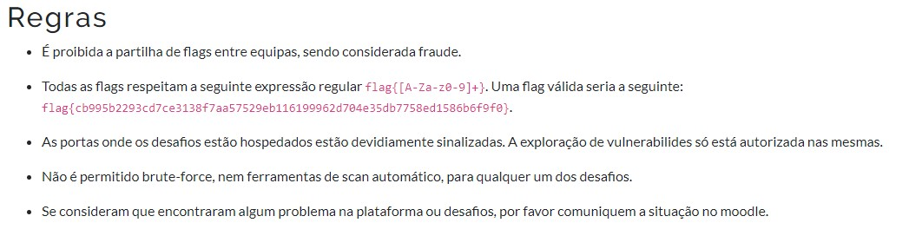

Fomos às rules do desafios ctf, encontramos a flag, copiamos a flag, colamos na caixa de texto do sanity check e submetemos. Só acertamos à segunda tentativa porque pensavamos que a flag era só o que estava dentro de chavetas.

