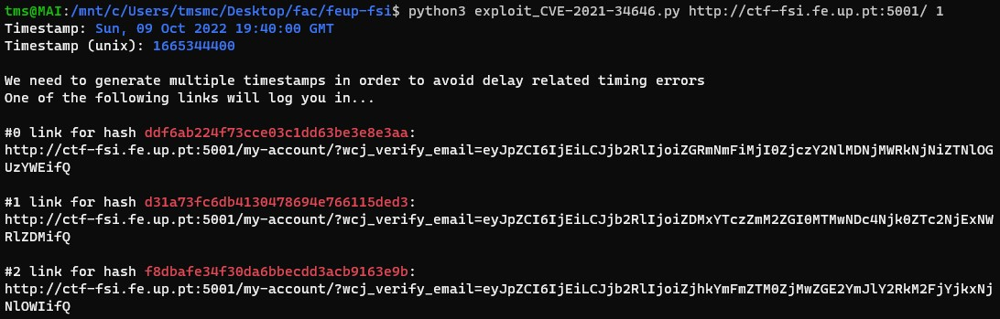

## CTF 2

### **Flags**

- flag{CVE-2021-34646}
- flag{please don't bother me}

### **Resolução**

Depois de analisar o site e o seu código descobrimos o seguinte:

- Versão Wordpress: 5.8.1
- Plugins instalados: WooCommerce 5.7.1 e WooCommerce Booster Plugin 5.4.3
- Utilizadores: admin e Orval Sanford

Vulnerabilidade escolhida: Authentication Bypass\
CVE utilizado: CVE-2021-34646

**Utilização da CVE**:

- Indo a este site "https://www.exploit-db.com/exploits/50299" podemos encontrar indicações e um script que nos permitem ganhar acesso tendo apenas o id de um utilizador que é encontrado no seguinte endereço: "http://ctf-fsi.fe.up.pt:5001/wp-json/wp/v2/users/".
- Tendo o id de "admin" que é 1 podemos começar o nosso ataque.

```sh
## template de utilização do script: ./exploit_CVE-2021-34646.py https://target.com/ 1

python3 exploit_CVE-2021-34646.py http://ctf-fsi.fe.up.pt:5001/ 1
```

- Depois do script rodar são apresentados os seguintes links:   




- Depois de copiar um link dos gerados e verificarmos que temos acesso podemos visitar "http://ctf-fsi.fe.up.pt:5001/wp-admin/edit.php" onde podemos ver o post privado que contém a flag.


