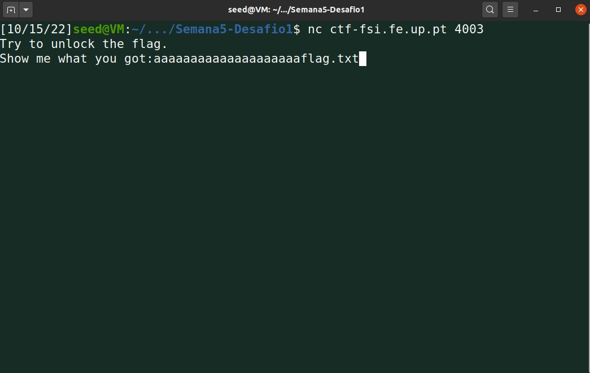
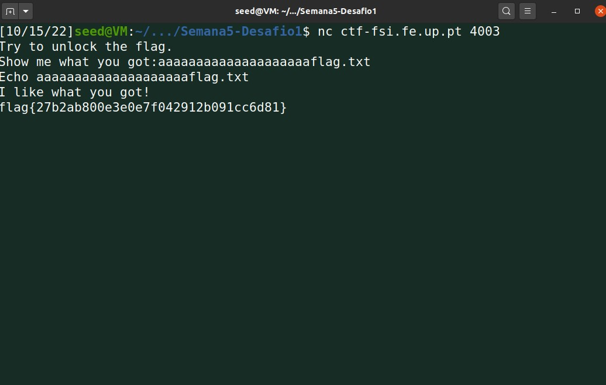
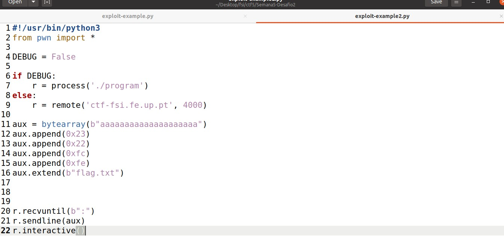
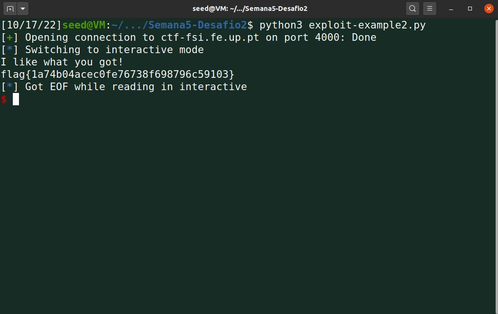

# CTF 5 D1

- Primeiramente fazemos download das ferramentas que nos dão
- Depois de analisarmos o código dá para perceber que são lidos 28 caracteres que depois são guardados num buffer que só tem capacidade para 20 caracteres.
- Utilizando esta vulnerabildade podemos fazer o seguinte: 

- Ao darmos input de 20 caracteres enchemos o buffer utilizando os 8 caracteres que sobram para guardar o nome do ficheiro que realmente queremos abrir.

# CTF 5 D2

- Neste caso vamos usar o script de python fornecido com umas ligieiras alterações:

- Como no desafio 1 o buffer tem 20 bytes alocados o que faz com que ao dar scanf de 32 bytes haja overflow.
- Começamos por encher o buffer com 20 caracteres e nos restantes colocamos o endereço com a ordem inversa (por causa da stack) e o nome do ficheiro no fim.
- Ao rodar o scrip obtemos o seguinte:
