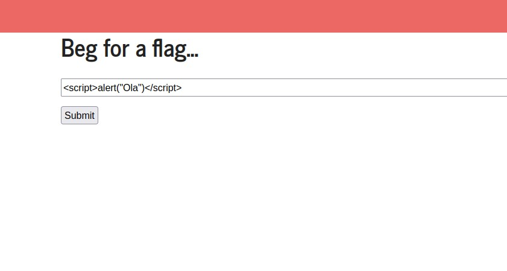
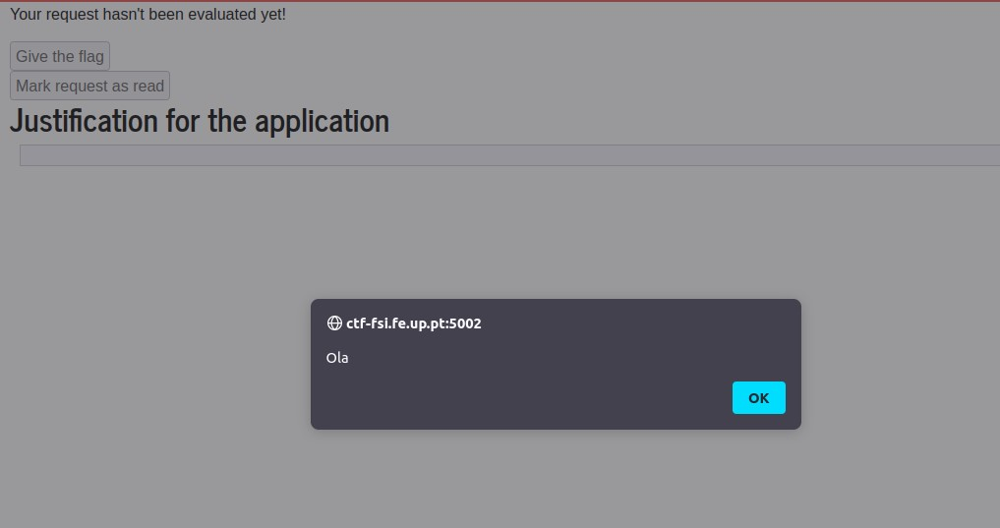
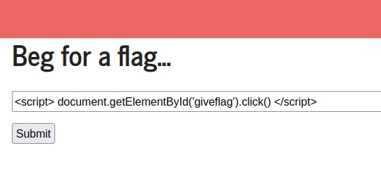
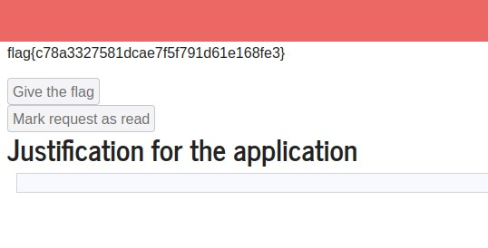

# LOGBOOK10

## **CTF 10**

## **Taks 1**

### The strategy to solve this CTF was using XSS attack, and waiting 2 minutes for the administrator approval.

 

### **First we try some things to define whats the approach we using**

|Script| Alert Trigger |
|:---------:|:---------:|
| || 

- We knew that the input was not being sanitized and because of that we can inject javascript code.
- We can conclude that we will have to do a Cross-site scripting attack (XSS).
- If we connect "visto" with the "read" on the random form that is dumped in the HTML we can easily understand what is happening.

### **We can use XSS to click on disabled button**

|Script| WebPage  |
|:---------:|:---------:|
| || 

## **Taks 2**

